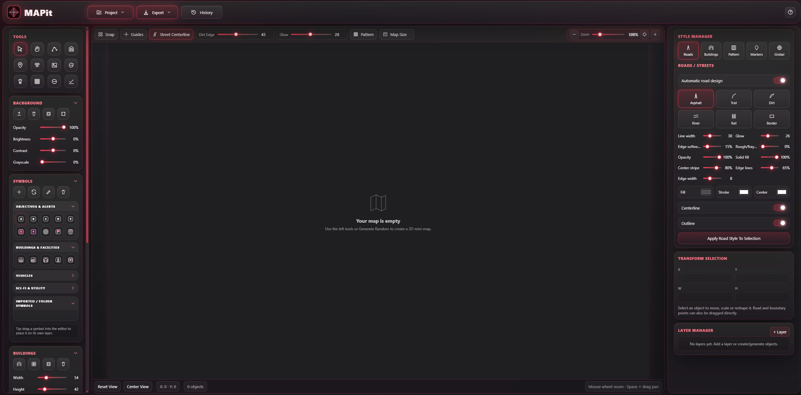
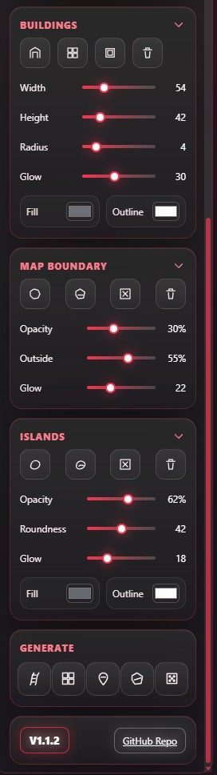
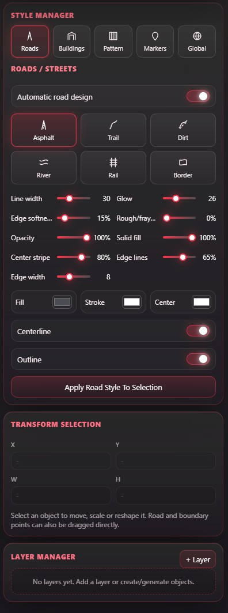

# MAPit Static Web Mini-Map Editor

MAPit is a lightweight static 2D mini-map editor for creating game-ready tactical maps, road layouts, building blocks, symbols, islands, map boundaries and layered pattern overlays.

The application runs completely in the browser through a local static webserver. Project data is saved and loaded through browser download/upload APIs and is stored as `.MAPit` JSON.

---

## Prerequisites

### Python

MAPit uses a small local webserver for offline development and local use.

Recommended environment:

- **Python 3.12+**
- A modern browser such as Chromium, Microsoft Edge or Firefox

Python is only required to serve the static files locally. The editor itself is written in HTML, CSS and JavaScript.

---

## Installation on Windows

### Option A: Install Python through winget

```cmd
winget install Python.Python.3.12
```

### Option B: Install Python through the official Windows installer

```text
https://www.python.org/downloads/windows/
```

### Option C: Use Python Manager

```text
https://docs.python.org/dev/using/windows.html
```

---

## Previews





---

## Start

Use the included Windows starter:

```bat
start_MAPit.bat
```

Then open:

```text
http://127.0.0.1:5501/
```

A local webserver is required because browsers restrict some file loading features when `index.html` is opened directly from disk. The starter uses Python's built-in static webserver. Any other static webserver can be used as long as it serves the project root.

---

## Basic Workflow

1. Start the local server with `start_MAPit.bat`.
2. Create a new empty project and choose the target map resolution.
3. Import a reference background if needed.
4. Draw roads, boundaries, islands, buildings, labels, zones and symbols.
5. Organize objects with the Layer Manager.
6. Adjust colors, opacity, glow, line width, pattern overlays and grid settings.
7. Export the final map as PNG, JPG, WEBP, layer JSON, `.MAPit` project data or a layered ZIP package.

---

## Controls

| Action | Input |
|---|---|
| Select object | Select tool + left click |
| Multi-select | Select tool + drag selection area |
| Move object | Drag selected object |
| Scale selected boundary or island | Drag a selection corner handle |
| Move road, boundary or island point | Drag visible point handle |
| Draw road spline | Road/Spline tool + click points |
| Finish road spline | Finish Spline button |
| Place building | Building tool or Building Stamp |
| Place symbol | Select symbol, then click map or drag symbol into the editor |
| Delete object | Delete tool + click object |
| Area delete | Delete tool + drag area |
| Pan viewport | Pan tool or Space + drag |
| Zoom viewport | Mouse wheel, zoom buttons or zoom slider |
| Reset zoom to 100% | Crosshair/reset icon in the editor zoom control |
| Undo / redo | History menu or keyboard shortcuts if enabled by browser focus |

---

## Important Notes

- MAPit is a static web project and does not require Node.js, npm, Electron or a build step.
- The app is intended to run offline after extraction.
- Do not replace local vendor paths with CDN links if the project should stay offline-capable.
- Editable project data is saved as `.MAPit` JSON.
- Raster exports use the configured map resolution from the Map Size menu.
- Browser download APIs are used for saving and exporting files.
- Imported backgrounds and imported symbols may be embedded in project data as browser-readable data URLs.
- The in-app documentation is loaded from `assets/documentation.md`.

---

## Main Features

### Project Resolution

The Map Size menu inside the editor toolbar defines the internal canvas and export resolution. Presets such as 1600 × 1000, 1920 × 1080, 2048 × 2048 and 4096 × 4096 are available, and custom pixel sizes can be entered manually.

The selected resolution controls raster export size.

### 2D Editor Canvas

The central editor canvas is the main work area. It supports object selection, spline editing, symbol placement, map boundary editing, island generation, pattern overlays and zoom/pan navigation.

The editor starts empty by default. Layers and objects are created when the user creates content.

### Roads and Splines

Roads are drawn as editable spline paths. Road styling includes road width, fill color, stroke color, opacity, solid fill strength, center stripe, edge lines, edge softness, rough dirt-road edges and glow strength.

### Buildings

Buildings can be placed directly, generated procedurally or stamped with a configured width and height. Building styling includes fill color, outline color, glow outline, outline thickness, corner radius, opacity, shadow and generated density.

### Map Boundaries

Map boundaries define the playable or visible area of the map. The surrounding area can be darkened to create a tactical map mask. Selected boundaries can be edited point-by-point or scaled through the corner handles on the selection frame.

### Islands

The Islands tool creates rounded, more organic terrain shapes. It is useful for natural island outlines, water maps, strategy-map landmasses and stylized terrain areas.

### Symbols

MAPit includes built-in symbol categories for objectives, alerts, buildings, vehicles, utilities and sci-fi map markers. Additional PNG and ICO symbols can be placed in:

```text
assets/imported_symbols/
```

The symbol list can be expanded and organized in the left panel. Symbols can be selected and placed by click or dragged into the editor. Each placed symbol can create its own layer for easier management and export.

### Pattern Overlays

Pattern overlays can be stacked on separate pattern layers. Built-in pattern types include dots, diagonal lines, square grid, hex grid, scan lines, tactical hatching, plus marks, triangles, honeycomb, cross marks and rings.

### Global Canvas Grid

The Global style section can toggle an editor grid behind the map. Grid size, color and opacity can be adjusted. This grid is an editor aid and can be configured separately from pattern overlays.

### Layer Manager

The Layer Manager organizes all map content. Layers can be renamed, described, toggled, locked, enabled for export, deleted and reordered through drag-and-drop.

### History

The top-bar History menu lists recent editing actions and provides undo/redo controls.

### Import and Export

MAPit supports `.MAPit` project save/load, PNG/JPG/WEBP raster export, active layer PNG export, layer JSON export, layered ZIP export, background import and symbol import.

---

## Documentation

The info button in the top right opens a formatted documentation panel. Its content is loaded from:

```text
assets/documentation.md
```

Edit that file to customize the in-app help text. Keep the app running through a local webserver so the browser can fetch the Markdown file.

---

## Offline Usage

The editor is intended to work without internet access after the ZIP has been extracted. Keep all runtime libraries and assets local. Do not replace local vendor files with CDN links.

---

## MAPit Scope

MAPit is a compact static 2D editor for fast mini-map layout, tactical map blocking and layered export preparation. It is not a full GIS application, CAD application or complete game level editor.

---

## License

Copyright (c) 2026 complicatiion aka sksdesign aka sven404  
All rights reserved unless explicitly granted below or otherwise mentioned/licensed, or generally based on an included open-source license.

See further details in:

```text
LICENSE.md
```

Review the license before redistribution, commercial use, internal reuse or public publication.

---

### © complicatiion aka sksdesign · 2026
